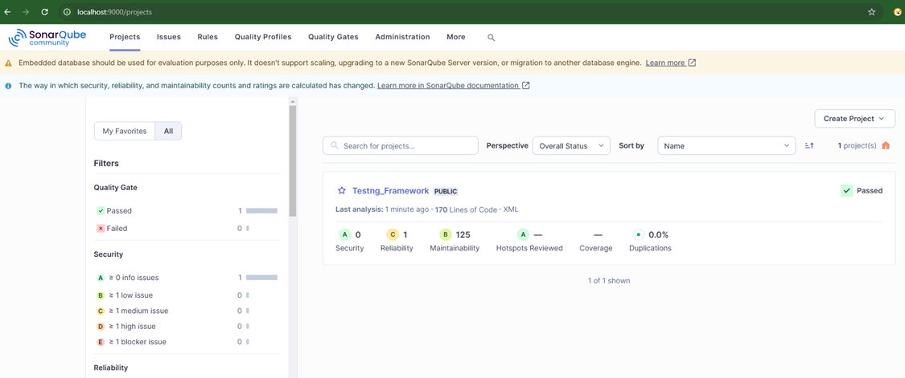
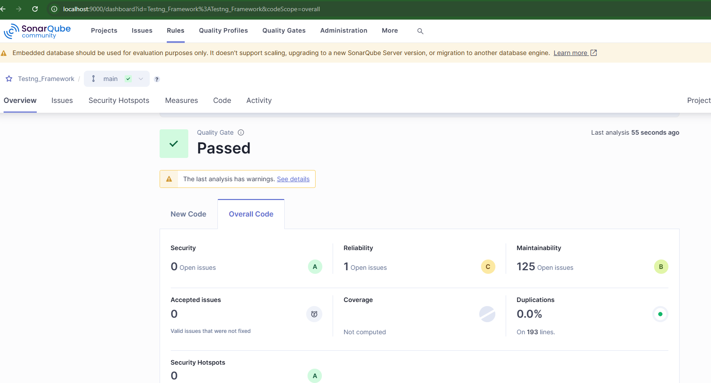

# TestNG Framework

## Overview
This project is a TestNG Framework designed to facilitate automated testing for Java applications. It includes configurations and utilities to help you write and run tests effectively.

## Features
- Easy integration with Java projects
- Simple configuration for TestNG
- Support for HTML reports
- Docker integration for containerized testing

## Getting Started
### Prerequisites
- Java JDK 8 or higher
- Maven
- Docker (optional)

### Installation
1. Clone the repository:
    ```sh
    git clone https://github.com/Rekapost/TestNG_Framework.git
    ```
2. Navigate to the project directory:
    ```sh
    cd TestNG_Framework
    ```
3. Install dependencies:
    ```sh
    mvn clean install
    ```

## *************   Running the Maven Project **************
- Locally
- Using ChainTest Service
- In Selenium Grid
- With Parallel Testing
- For Cross-Browser Testing
- Using Docker Container
- Through Jenkins File
- Via Docker File
- In the Cloud using Lambda Service
- With Static Code Analysis
- For Performance Testing (Stress Test)
- Generating Allure Report
- Generating Extent Report
- Generating ChainTest Report


### Running Tests
To run the tests, use the following command:
```sh
mvn test
```

## 1. Running the Maven Project
Navigate to the project directory where `pom.xml` is located and run:
```sh
mvn clean
mvn compile
mvn test        # or `mvn install`
mvn clean test  # or `mvn clean install`
```

## 2. Running the Maven Project Using Chaintest Service
Navigate to the Docker folder and run:
```sh
docker-compose -f docker-compose-h2.yml up
```
Chaintest report available at: [http://localhost:8081/](http://localhost:8081/)

### Verify Port Availability
Before starting your service, ensure the port (e.g., `8081`) is free and not being used by another application. If the service fails to start, it could be because another application is already using the port.

#### On Windows:
1. Open **Command Prompt** and check if port `8081` is in use:
   ```sh
   netstat -ano | findstr :8081
   ```
   If another process is using the port, an output like this appears:
   ```
   TCP    127.0.0.1:8081    0.0.0.0:0    LISTENING    [PID]
   ```
2. Kill the process using the port:
   ```sh
   taskkill /PID [PID] /F
   ```

### Reports are saved at:
- `/target/chaintest/Index.html`
- `/target/chaintest/Email.html`

## 3. Setting Up Selenium Grid with Docker
Set up a Selenium Grid with a Hub and a Chrome Node using Docker and Selenium. 

### Prerequisites
Ensure you have:
- Docker
- wget

### Steps:
#### 3a. Download Selenium Server
Purpose: This command downloads the Selenium Server JAR file from the official Selenium GitHub releases.
What it does:
It fetches the selenium-server-4.27.0.jar file, which contains all the necessary components to run the Selenium Hub. This is required for setting up the Hub on a machine (before you run the Hub).
```sh
wget https://github.com/SeleniumHQ/selenium/releases/download/selenium-4.27.0/selenium-server-4.27.0.jar
```

#### 3b. Start Selenium Hub
Purpose: This command starts the Selenium Hub by running the Selenium Server JAR file.
What it does:
The -jar flag tells Java to execute the selenium-server-4.27.0.jar file.
hub is the command that starts the Selenium Grid Hub. This Hub acts as a central point that controls the Selenium Nodes (browsers) and distributes test scripts to them.
It listens on port 4444 by default, and this is where the test scripts will connect to execute tests on different browsers and platforms.
```sh
java -jar selenium-server-4.27.0.jar hub
```

#### 3c. Pull Selenium Standalone Chrome Image
Purpose: This command pulls the Selenium Standalone Chrome Docker image from the Docker Hub.
What it does:
docker pull downloads the Docker image selenium/standalone-chrome from the Docker Hub, which contains both a Selenium Node (specifically with Chrome) and a Selenium WebDriver for browser automation.
This image is used to create a Docker container that will run the Chrome browser in a Selenium Grid as a Node.
```sh
docker pull selenium/standalone-chrome
```

#### 3d. Run Selenium Node in Docker
Purpose: This command runs a Selenium Node in a Docker container using the previously pulled Selenium Standalone Chrome image.
What it does:
-d runs the container in detached mode (in the background).
-p 5555:4444 maps port 4444 inside the container (which Selenium uses to communicate with the Hub) to port 5555 on your local machine, so you can access the Node via localhost:5555.
--name selenium-hub1 gives a custom name to the container (selenium-hub1), which you can reference later.
This starts the Selenium Node with Chrome as the browser, which will register itself with the Selenium Hub that is running on port 4444.
```sh
docker run -d -p 5555:4444 --name selenium-hub1 selenium/standalone-chrome
```

#### 3e. Verify Selenium Node Status
Purpose: This command checks the status of the Selenium Node to ensure it’s running and properly connected to the Hub.
What it does:
curl sends a request to the given URL (http://localhost:5555/wd/hub/status).
It checks if the Selenium Node running on port 5555 is up and functioning by returning a status JSON response.
If everything is set up correctly, you should see a response with information about the Node, including its capabilities, browser information, and status.
```sh
curl http://localhost:5555/wd/hub/status
```

## 4. Running TestNG Tests with Maven
Create a batch file (`run.bat`):
```sh
cd C:\Users\Reka\eclipse-workspace\TestNG_Framework\Reka.TestNG_Framework_DDT
mvn clean install
```

## 5. Generating Allure Report
Navigate to the folder containing `allure-results` and run:
```sh
allure serve allure-results
```

## 6. Extent Report Location
```sh
/test-output/Test-Report-********.html
```

## 7. Running your TestNG tests inside a Docker container.

### 7a. Dockerfile Setup
Ensure the `Dockerfile` includes dependencies for TestNG.
Make sure your Dockerfile is set up correctly to build the image with all dependencies for TestNG.

### 7b. Build the Image
```sh
docker build -t testng-framework .
```

### 7c. Run the Container
This will start the container and execute the CMD defined in your Dockerfile.
```sh
docker run --name testng-container testng-framework
```

### 7d. Run in Interactive Mode
This gives you a terminal inside the container if you need to debug or run commands manually.
```sh
docker run -it --name testng-container testng-framework
```
Inside the container:
```sh
mvn test
```

### Stopping and Removing Containers
```sh
docker stop testng-container
docker rm testng-container
```
If You Need to Rerun Without Rebuilding
To avoid errors like "container already exists," remove the old container:
```sh
docker rm testng-container
```

## 8. ChromeDriver Setup
```java
System.setProperty("webdriver.chrome.driver", "./drivers/chromedriver.exe");
WebDriverManager.chromedriver().setup();
ChromeOptions chromeOptions = new ChromeOptions();
chromeOptions.setHeadless(true);
driver = new ChromeDriver(chromeOptions);
```
```java
System.setProperty(CHROME_DRIVER, System.getProperty("user.dir")+"//drivers//chromedriver.exe");		
WebDriverManager.chromedriver().setup(); or WebDriverManager.chromedriver().clearDriverCache().setup();	
or  WebDriverManager.chromedriver().browserVersion("132.0.6834.159").setup();
ChromeOptions chromeOptions = new ChromeOptions();
chromeOptions.setPageLoadStrategy(PageLoadStrategy.NORMAL);
chromeOptions.setAcceptInsecureCerts(true);
chromeOptions.setScriptTimeout(Duration.ofSeconds(30));
chromeOptions.setPageLoadTimeout(Duration.ofMillis(30000));
chromeOptions.setImplicitWaitTimeout(Duration.ofSeconds(20));
chromeOptions.addArguments("--remote-allow-origins=*");	  
chromeOptions.setBinary("/usr/bin/google-chrome-stable");  // Path to Chrome binary
chromeOptions.setBinary("/usr/bin/google-chrome"); // This is the path where Chrome is installed in Docker
chromeOptions.addArguments("--headless");  // Run Chrome in headless mode (no GUI)
chromeOptions.addArguments("--no-sandbox");  // Avoid running into sandbox issues in Docker
chromeOptions.addArguments("--disable-dev-shm-usage");  // Overcome issues with limited shared memory in containers
chromeOptions.addArguments("--remote-debugging-port=9222");  // Enable debugging if needed
driver =new ChromeDriver(chromeOptions);	or  driver=new ChromeDriver();  // instantiate chromedriver	
```

### To initialize your ChromeDriver without manually handling setup or system properties
```java
driver = WebDriverManager.chromedriver().create();
```
### Automatically downloads and sets up the compatible ChromeDriver
```java
driver.set(WebDriverManager.chromedriver().capabilities(chromeOptions).create());
```

## 9. Running Tests in Parallel
Thread Safety: Ensure ThreadLocal<WebDriver> Is Used
private static final ThreadLocal<WebDriver> driver = new ThreadLocal<>();
Since you're running in parallel, ensure you're using ThreadLocal<WebDriver> correctly. use getDriver() for any interactions.
For example, replace any direct driver.findElement(...) with getDriver().findElement(...).
thread-count="X": Specifies how many threads to use for parallel execution. You can set the value based on your requirements (e.g., thread-count="4").
parallel="classes": Runs entire test classes in parallel.
TestNG XML:
```xml
<suite name="TestSuite" thread-count="2" parallel="classes">
    <classes>
        <class name="testCases.TestCase"/>
        <class name="testCases.TestCaseDDT"/>
    </classes>
</suite>
```
### To run classes and methods in parallel
parallel="both": Runs both test methods and test classes in parallel.
class 1 with 1 method and class 2 with 1 dataprovider method that runs 4 times 
<suite name="TestSuite" thread-count="4" parallel="both">

parallel="methods": Runs test methods in parallel within the same test class.
   @Test
    public void testLogin1() {
        System.out.println("Test 1: Logging in...");
    }
    @Test
    public void testLogin2() {
        System.out.println("Test 2: Logging in...");
    }
<suite name="ParallelTestSuite" parallel="methods" thread-count="4">
<class name="LoginTest"/>

### Optional Parameter: It makes the parameter optional in the sense that the test can still run if the parameter isn't provided. You can configure it to fall back to a default browser like Chrome or Firefox, depending on what you need.
The @Optional("chrome") annotation in TestNG allows you to specify a default value for a method parameter in case the parameter is not provided explicitly via the testng.xml file or other test configuration.
@Optional("chrome") String br

## 10. Cross-browser Testing
Define parameters in `testng.xml`:
```xml
<parameter name="browser" value="firefox"/>
```
Use `@Parameters` annotation in BaseClass:
```java
@Parameters({"browser"})
public void setup(String br) { ... }
```

## 11. Remote WebDriver Execution
To execute your tests in a distributed manner or want to connect to a remote Selenium Grid or a Selenium server.
```java
driver = new RemoteWebDriver(new URL("http://localhost:6666/wd/hub"), chromeOptions);
```
To instantiate a RemoteWebDriver object that communicates with a remote Selenium WebDriver server (such as a Selenium Grid, BrowserStack, Sauce Labs, or a local Selenium server running on localhost). The URL points to the Selenium Hub (which can manage multiple WebDriver instances) and the chromeOptions are passed to configure Chrome's settings.
Parallel Execution: You can run tests on multiple machines or environments simultaneously.
Cross-Browser Testing: You can test your application on various browsers and OS combinations, even if those browsers are not installed on your local machine.
### Hub Console:
URL: http://localhost:5555/grid/console
Purpose: This page will show the current status of your Selenium Grid. It will display the connected nodes, their status (idle or busy), and allow you to see the grid configuration. You won't see individual test logs here, but it gives a general view of the grid.
### WebDriver Endpoint:
URL: http://localhost:5555/wd/hub
Purpose: This URL serves as the WebDriver endpoint that allows your tests to communicate with the Selenium Grid. If the server is running, you may see a JSON response showing the status of the WebDriver, but it won't show detailed logs or outputs.
When starting a Selenium Node, you can enable logging by using the -log option. This will direct the logs to a specified file, or you can simply view them in the terminal.
java -Dselenium.verbose=true -jar selenium-server-<version>.jar -role node -hub http://localhost:5555/grid/register -log selenium-node.log
### This will:
Start the Selenium Node and register it with the Hub (localhost:5555).
Write logs to a file named selenium-node.log in the current directory.
Output logs to the terminal if the -verbose flag is used.
### Key parts of the command:
-Dselenium.verbose=true: This will provide verbose output to show detailed logs.
-log selenium-node.log: Logs will be saved to this file.

## Selenium Grid Hub logs
```sh
java -Dselenium.verbose=true -jar selenium-server-<version>.jar -role hub -log selenium-hub.log`
```

## 11. Lambda Test
LambdaTest is a cloud-based testing platform that allows you to perform cross-browser testing of your web applications. It provides a wide range of real browsers, operating systems, and devices, so you can ensure your web app works perfectly across different environments without needing to maintain a physical device lab.
11a. Set Up LambdaTest Capabilities: When running Selenium tests on LambdaTest, you’ll configure your desired capabilities to specify the browser, OS, and version.
```java
DesiredCapabilities capabilities = new DesiredCapabilities();
capabilities.setCapability("browserName", "Chrome");
capabilities.setCapability("browserVersion", "latest");
capabilities.setCapability("platformName", "Windows 10");
capabilities.setCapability("LT:Options", new HashMap<String, Object>() {{
    put("user", "YOUR_USERNAME");
    put("accessKey", "YOUR_ACCESS_KEY");
    put("build", "Your Build Name");
    put("name", "Your Test Name");
}});
WebDriver driver = new RemoteWebDriver(new URL("https://hub.lambdatest.com/wd/hub"), capabilities);
```

11b. Run Tests in the Cloud: Your Selenium scripts will now run in the LambdaTest cloud instead of your local browser.
        <parameter name="browser" value="chrome" />
        <parameter name="isLambdaTest" value="true"/>
        <parameter name="isHeadless" value="true"/>

## 12. Running Tests Using `testng.xml`
To ensure a clean build and avoid issues from old compiled files.
To run tests defined in a specific TestNG configuration (testng.xml).
Useful for custom test executions like running only regression tests or parallel test suites.
```sh
mvn clean test "-Dsurefire.suiteXmlFiles=testng.xml"
```

## 13. Running Jenkins in Docker
containerized Jenkins environment, you can run Jenkins itself inside Docker.
To start a Jenkins container
```sh
docker run -d --name jenkins \
  -p 8080:8080 -p 50000:50000 \
  -v /var/run/docker.sock:/var/run/docker.sock \
  -v jenkins_home:/var/jenkins_home \
  jenkins/jenkins:lts
```
or 

```sh
docker run -d --name jenkins -p 8080:8080 -p 50000:50000 -v /var/run/docker.sock:/var/run/docker.sock -v jenkins_home:/var/jenkins_home jenkins/jenkins:lts
```

### Retrieve Jenkins Admin Password
```sh
docker exec -it jenkins cat /var/jenkins_home/secrets/initialAdminPassword
```

## 14. Running Tests in Jenkins Pipeline
Create `Jenkinsfile` for pipeline execution.

## 15. Creating and Pushing Docker Image
```sh
docker build -t reka83/maven-chrome -f Dockerfile-maven-chrome .
docker push reka83/maven-chrome
```

To start the container:
```sh
docker run -d --name maven-chrome reka83/maven-chrome
```

To check running containers:
```sh
docker ps -a
```

To restart the container:
```sh
docker start maven-chrome
```

# Performance Testing with k6

## Installation  

You can install **k6** using the following methods:

### Using Winget
```sh
winget install k6
winget install --id k6.k6 -e
```

### Using Docker
```sh
docker pull grafana/k6
```
---

## Running Grafana-k6  

Follow these steps to run a performance test:
1.	Run a test.
2.	Add virtual users.
3.	Increase the test duration.
4.	Ramp the number of requests up and down as the test runs.
```sh
npm init
```
Package.json gets created 

### 1. Run a Basic Test
```sh
k6 run stress-test.js
k6 run load-test.js
```

### 2. Run a Test with Virtual Users (VUs)  
To simulate 10 virtual users for 30 seconds:
```sh
k6 run --vus 10 --duration 30s script.js
```
To see output in string format 
```sh
k6 run --out json=results.json stress-test.js
jq . results.json
```

## Static Code Analysis using Sonar Qube
winget install unzip
### Step 1: Install Prerequisites
Ensure you have the following installed:
✅ Java 11 or later (JDK)
✅ Maven (Download from Apache Maven)
✅ SonarQube Community Edition

### Step 2: Download and Extract SonarQube
Download SonarQube from: 🔗 SonarQube Downloads
Extract the ZIP file to C:\SonarQube
Rename the extracted folder to sonarqube
### Step 3: Configure SonarQube
Open the C:\SonarQube\sonarqube\conf\sonar.properties file in Notepad.
Modify the following lines to use localhost:
- sonar.web.host=127.0.0.1
- sonar.web.port=9000
- sonar.search.javaAdditionalOpts=-Dnode.store.allow_mmap=false
Save and close the file.
### Step 4: Start SonarQube
#### Step 1:Open Command Prompt (Run as Administrator)
Navigate to the SonarQube bin folder:
``` sh
cd C:\SonarQube\sonarqube\bin\windows-x86-64
```
Start SonarQube:
```sh
StartSonar.bat
```
Wait for SonarQube to start and open http://localhost:9000 in your browser.
Default Username: admin
Default Password: admin
#### Step 1: Add the SonarQube Plugin to Your pom.xml
#### Step 2: Generate a Sonar Token
Go to http://localhost:9000
Click on Your Profile (Top Right) → My Account → Security
Generate a new token (e.g., sonar-token)
#### Step 3: Run SonarQube Analysis
Open Command Prompt in your Maven project folder and run:

```sh
mvn clean verify sonar:sonar -Dsonar.host.url=http://localhost:9000 -Dsonar.login=<YOUR_TOKEN>
```
3️⃣ View Analysis in SonarQube
Open http://localhost:9000 in your browser.
You will see your project's code quality, security vulnerabilities, and test coverage.
🚀 SonarQube is now integrated with your Maven project!


